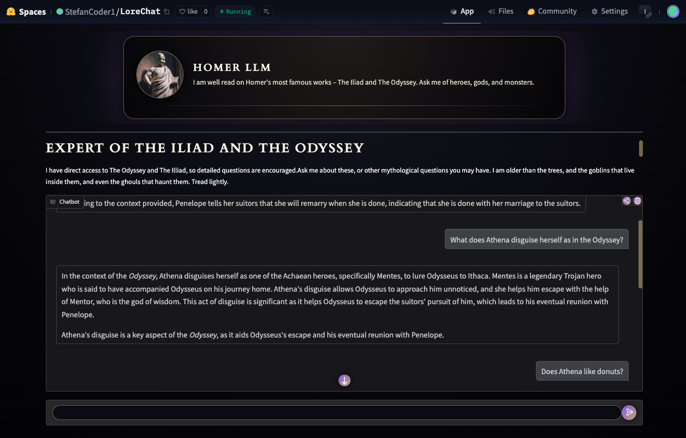
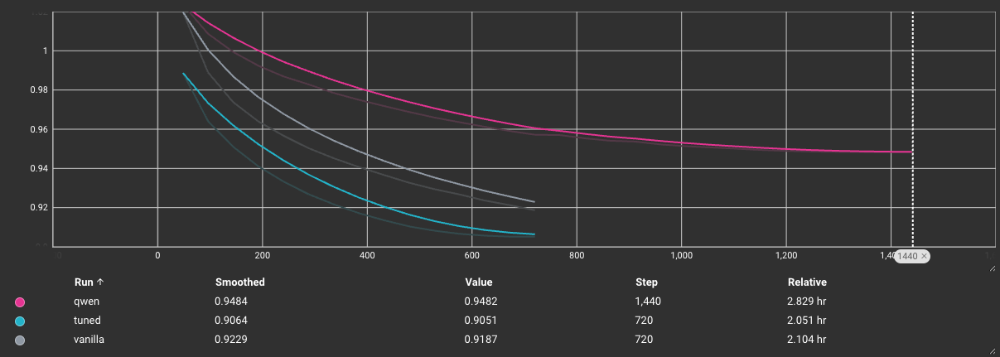
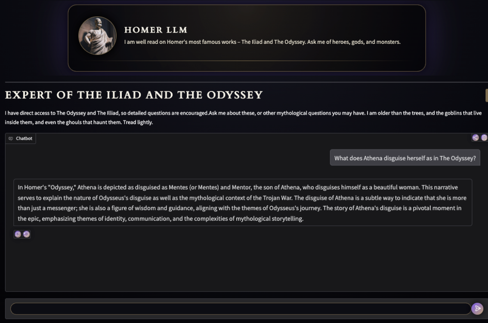
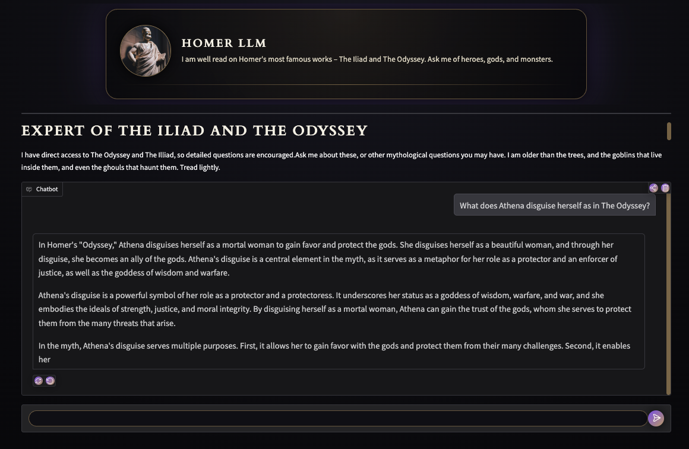

# 🏛️ Homer-LLM: Greek Mythology Q&A via RAG-Enhanced LLMs

| | |
| :--- | :--- |
| **Hugging Face Space** | [https://huggingface.co/spaces/StefanCoder1/LoreChat](https://huggingface.co/spaces/StefanCoder1/LoreChat) |
| **Members** | Jarl Stephansson & Stefan Ivchenko |

---

**ALL THE MODELS TRAINED FOR THIS PROJECT ARE FOUND HERE:** https://huggingface.co/StefanCoder1
The purpose of this model is to learn more about Homer's great works and mythology! If you need to brush up on The Odyssey or The Iliad, that time is now!

## Project Overview

This project focuses on **Parameter-Efficient Fine-Tuning (PEFT)** using **LoRA** to tune various **Large Language Models (LLMs)** for **Question Answering (QA)** tasks related to **Greek Mythology**.

This README outlines the different training and evaluation approaches used for our model candidates. The final implementation leverages **Retrieval-Augmented Generation (RAG)** to fetch information directly from Homer's two epics, ***The Odyssey*** and ***The Iliad***, significantly reducing the likelihood of **hallucinations** and ensuring factual accuracy.

---

## 📚 Datasets

Two distinct QA datasets were utilized for fine-tuning.

### FineTome-100k

To enhance the general QA capabilities of the models, we used a subset of the original [The-Tome dataset](https://huggingface.co/datasets/arcee-ai/The-Tome), sourced from the [mlabonne/FineTome-100k](https://huggingface.co/datasets/mlabonne/FineTome-100k) dataset on Hugging Face.

* **Split:** A **train/validation/test** split of **94.5% / 5% / 0.5%** was created for hyperparameter tuning and final evaluation.
* This dataset was shuffled and combined with the **Stackexchange Mythology** dataset.

### Stackexchange Mythology

This is a **5,000-entry** QA dataset scraped from the **Mythology and Folklore Stackexchange** ([https://mythology.stackexchange.com/](https://mythology.stackexchange.com/)).

* **Format:** It was converted to the same format as the **FineTome** dataset for seamless integration.
* **Relevance:** This dataset aligns well with the project's end goal, as it is highly focused on **Greek Mythology**.
* **Split:** A **train (90%)** and **test (10%)** split was used.
* **Data Augmentation:** The training data was **duplicated** to increase its weight and presence during the fine-tuning process, maximizing the model's learning on this domain-specific knowledge.
* **Example:**

> **Question:** Many of the Greek gods were bisexual. Did Zeus have any male lovers?
> **Answer:** Yes, in Greek mythology, Zeus is known to have had several male lovers. One of the most notable relationships was with **Ganymede**, a beautiful young Trojan prince. Zeus was so taken with Ganymede that he transformed into an eagle and abducted him to Mount Olympus, where Ganymede became the cupbearer for the gods and was granted immortality. Another figure often associated with Zeus is **Hyacinth**...

---

## 🤖 Models & Training

All models were fine-tuned using the same core **hyperparameters** as the base notebook, with adjustments made to the **learning rate (LR)**, **LR schedule**, and **batch size** based on available compute resources. The base, untrained model was also included in the evaluation baseline.

### Vanilla Model (Llama-3.2-1B)

The initial iteration used the **unsloth/Llama-3.2-1B-bnb-4bit** model.

* **Training:** Trained for **one epoch** (due to compute limitations).
* **LR Schedule:** Set to **constant** to allow for checkpointing and continuation.
* **Learning Rate:** Lowered to **$0.0001$**.

### Tuned Model (Llama-3.2-1B)

Based on the **TensorBoard** logs from the Vanilla run, the LR was deemed too low.

* **Changes:** The learning rate was **increased**, and the LR schedule was changed to **cosine** for better convergence.
* **Setup:** The remainder of the setup was identical to the Vanilla model.

### Qwen Model (Qwen2-0.5B)

Recognizing that the final application would run on a resource-constrained CPU, we tested the even smaller **unsloth/Qwen2-0.5B-bnb-4bit** model.

* **LR Scheme:** Identical to the Tuned model (cosine schedule).
* **Training:** Trained for **two epochs** to ensure a fair comparison and capitalize on the faster training time of the smaller model.

---

## 📊 Evaluation

Model evaluation involved two primary methods: a **quantitative metric** analysis and a **qualitative LLM-as-a-judge** comparison.

### Quantitative Metrics

Forward passes were run on the test dataset to calculate **Perplexity (PPL)** and **Loss**.

| Model        | Loss             | PPL (Perplexity)|
| :----------- | :--------------- | :---------- |
| **Original** | 8.469            | 4767.093    |
| **Vanilla**  | 8.372            | 4322.123    |
| **Tuned**    | 6.931            | 1023.584    |
| **Qwen**     | **6.643**        | **767.510** |

### Qualitative Generation

Models were tested on **10 prompts** from the test dataset, and a separate LLM was used as a judge to determine the best-performing model based on answer quality. The questions and answers are found in the **Generate_eval.csv**. 

* **Qwen:** 7 wins
* **Tuned (Llama):** 3 wins
* **Vanilla (Llama):** 0 wins

**Observation:** The significantly smaller **Qwen** model unexpectedly outperformed the two larger **Llama** variants, despite having a worse validation loss. This suggests that the Qwen model learned the **Mythology-specific** content (which comprises 50% of the test set) much more effectively, while the Llama models may have retained better **generalization** outside of that specific domain.

---

## 🚀 Deployment

The **Qwen** model was selected for final deployment due to its superior evaluation scores and faster inference speed, making it optimal for a resource-constrained environment.

* **Conversion:** The model was converted to the CPU-compatible **GGUF** format and quantized to **4-bits**.
* **RAG Implementation:** **Retrieval-Augmented Generation (RAG)** was implemented using **OpenAI embeddings** and a **Chroma vectorized database**.
* **Knowledge Base:** The RAG system grants the model access to three key documents for retrieval:
    * ***The Iliad***
    * ***The Odyssey***
    * **Wikipedia pages** for both epics
* **Final Deployment:** The finished application is deployed on Hugging Face Spaces:
    * **Space URL:** [https://huggingface.co/spaces/StefanCoder1/LoreChat](https://huggingface.co/spaces/StefanCoder1/LoreChat)

In order to show the importance of RAG; a example with and without RAG is provided bellow: 

**RAG-answer:**

(**context**: A mosaic depicting Odysseus, from the villa of La Olmeda, Pedrosa de la Vega, Spain, late 4th–5th centuries AD\nTen years after the Achaean Greeks won the Trojan War, Odysseus, king of Ithaca, has yet to return home from Troy. In his absence, 108 boorish suitors court his wife Penelope. Penelope tells them she will remarry when she is done weaving a shawl; however, she secretly unweaves it every night.\n\nThe goddess Athena, disguised first as Mentes then as Mentor, tells Odysseus's son Telemachus to seek news of his father. The two leave Ithaca and visit Nestor, who tells them that Agamemnon, the commander of the Greek army at Troy, was murdered soon after the war. Telemachus travels to Sparta to meet Agamemnon's brother Menelaus, who in turn describes his encounter with the shape-shifting god Proteus. Menelaus says he learned from Proteus that Odysseus is alive, but held captive by the nymph Calypso.)

**Without RAG:**

It is clear that without RAG, the model is still able to produce a coherent answer but with RAG, it is way more specific in its answer. 
